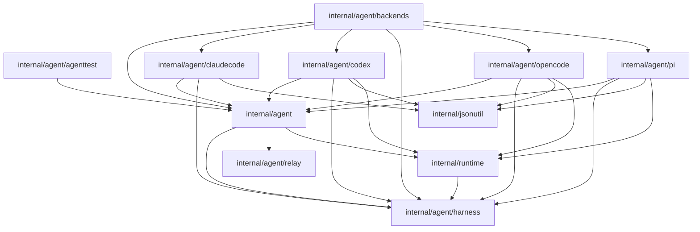

# Backend Architecture

This document maps direct Go package dependencies in `backend/`.

<!-- BEGIN GENERATED PACKAGE DEPENDENCIES -->
## Generated Package Dependencies

This section is generated by `scripts/update_backend_architecture.py`.
It uses direct package imports from `go list -json ./backend/...`.

Arrows point from the importing package to the package it imports. External
dependencies are omitted.

## Runtime Spine

```mermaid
graph TD
  pkg_cmd_caic["cmd/caic"]
  pkg_frontend["frontend"]
  pkg_internal_agent["internal/agent"]
  pkg_internal_agent_backends["internal/agent/backends"]
  pkg_internal_agent_claudecode["internal/agent/claudecode"]
  pkg_internal_agent_codex["internal/agent/codex"]
  pkg_internal_agent_harness["internal/agent/harness"]
  pkg_internal_agent_opencode["internal/agent/opencode"]
  pkg_internal_agent_pi["internal/agent/pi"]
  pkg_internal_agent_relay["internal/agent/relay"]
  pkg_internal_app["internal/app"]
  pkg_internal_auth["internal/auth"]
  pkg_internal_autoupdate["internal/autoupdate"]
  pkg_internal_bot["internal/bot"]
  pkg_internal_ci["internal/ci"]
  pkg_internal_eventreplay["internal/eventreplay"]
  pkg_internal_forge["internal/forge"]
  pkg_internal_forge_forgecache["internal/forge/forgecache"]
  pkg_internal_forge_forgemgr["internal/forge/forgemgr"]
  pkg_internal_forge_github["internal/forge/github"]
  pkg_internal_forge_gitlab["internal/forge/gitlab"]
  pkg_internal_httplog["internal/httplog"]
  pkg_internal_jsonutil["internal/jsonutil"]
  pkg_internal_mcp["internal/mcp"]
  pkg_internal_preferences["internal/preferences"]
  pkg_internal_repo["internal/repo"]
  pkg_internal_repo_repomgr["internal/repo/repomgr"]
  pkg_internal_repo_repowork["internal/repo/repowork"]
  pkg_internal_runtime["internal/runtime"]
  pkg_internal_runtime_mdruntime["internal/runtime/mdruntime"]
  pkg_internal_server["internal/server"]
  pkg_internal_server_api["internal/server/api"]
  pkg_internal_server_api_v1["internal/server/api/v1"]
  pkg_internal_server_api_v1conv["internal/server/api/v1conv"]
  pkg_internal_server_ipgeo["internal/server/ipgeo"]
  pkg_internal_task["internal/task"]
  pkg_internal_task_taskmgr["internal/task/taskmgr"]
  pkg_internal_usage["internal/usage"]

  pkg_cmd_caic --> pkg_internal_app
  pkg_cmd_caic --> pkg_internal_auth
  pkg_cmd_caic --> pkg_internal_autoupdate
  pkg_cmd_caic --> pkg_internal_forge_github
  pkg_cmd_caic --> pkg_internal_server
  pkg_internal_agent --> pkg_internal_agent_harness
  pkg_internal_agent --> pkg_internal_agent_relay
  pkg_internal_agent --> pkg_internal_runtime
  pkg_internal_agent_backends --> pkg_internal_agent
  pkg_internal_agent_backends --> pkg_internal_agent_claudecode
  pkg_internal_agent_backends --> pkg_internal_agent_codex
  pkg_internal_agent_backends --> pkg_internal_agent_harness
  pkg_internal_agent_backends --> pkg_internal_agent_opencode
  pkg_internal_agent_backends --> pkg_internal_agent_pi
  pkg_internal_agent_claudecode --> pkg_internal_agent
  pkg_internal_agent_claudecode --> pkg_internal_agent_harness
  pkg_internal_agent_claudecode --> pkg_internal_jsonutil
  pkg_internal_agent_codex --> pkg_internal_agent
  pkg_internal_agent_codex --> pkg_internal_agent_harness
  pkg_internal_agent_codex --> pkg_internal_jsonutil
  pkg_internal_agent_codex --> pkg_internal_runtime
  pkg_internal_agent_opencode --> pkg_internal_agent
  pkg_internal_agent_opencode --> pkg_internal_agent_harness
  pkg_internal_agent_opencode --> pkg_internal_jsonutil
  pkg_internal_agent_opencode --> pkg_internal_runtime
  pkg_internal_agent_pi --> pkg_internal_agent
  pkg_internal_agent_pi --> pkg_internal_agent_harness
  pkg_internal_agent_pi --> pkg_internal_jsonutil
  pkg_internal_agent_pi --> pkg_internal_runtime
  pkg_internal_app --> pkg_internal_agent
  pkg_internal_app --> pkg_internal_agent_backends
  pkg_internal_app --> pkg_internal_agent_harness
  pkg_internal_app --> pkg_internal_auth
  pkg_internal_app --> pkg_internal_bot
  pkg_internal_app --> pkg_internal_ci
  pkg_internal_app --> pkg_internal_eventreplay
  pkg_internal_app --> pkg_internal_forge
  pkg_internal_app --> pkg_internal_forge_forgecache
  pkg_internal_app --> pkg_internal_forge_forgemgr
  pkg_internal_app --> pkg_internal_forge_github
  pkg_internal_app --> pkg_internal_preferences
  pkg_internal_app --> pkg_internal_repo
  pkg_internal_app --> pkg_internal_repo_repomgr
  pkg_internal_app --> pkg_internal_repo_repowork
  pkg_internal_app --> pkg_internal_runtime
  pkg_internal_app --> pkg_internal_runtime_mdruntime
  pkg_internal_app --> pkg_internal_server
  pkg_internal_app --> pkg_internal_server_ipgeo
  pkg_internal_app --> pkg_internal_task
  pkg_internal_app --> pkg_internal_task_taskmgr
  pkg_internal_app --> pkg_internal_usage
  pkg_internal_auth --> pkg_internal_forge
  pkg_internal_autoupdate --> pkg_internal_forge_github
  pkg_internal_bot --> pkg_internal_forge
  pkg_internal_bot --> pkg_internal_forge_forgecache
  pkg_internal_ci --> pkg_internal_agent
  pkg_internal_ci --> pkg_internal_bot
  pkg_internal_ci --> pkg_internal_forge
  pkg_internal_ci --> pkg_internal_forge_forgecache
  pkg_internal_ci --> pkg_internal_preferences
  pkg_internal_ci --> pkg_internal_repo_repowork
  pkg_internal_ci --> pkg_internal_task
  pkg_internal_eventreplay --> pkg_internal_agent
  pkg_internal_eventreplay --> pkg_internal_agent_harness
  pkg_internal_eventreplay --> pkg_internal_server_api_v1
  pkg_internal_eventreplay --> pkg_internal_server_api_v1conv
  pkg_internal_forge_forgecache --> pkg_internal_forge
  pkg_internal_forge_forgemgr --> pkg_internal_auth
  pkg_internal_forge_forgemgr --> pkg_internal_bot
  pkg_internal_forge_forgemgr --> pkg_internal_forge
  pkg_internal_forge_forgemgr --> pkg_internal_forge_github
  pkg_internal_forge_forgemgr --> pkg_internal_forge_gitlab
  pkg_internal_forge_forgemgr --> pkg_internal_repo
  pkg_internal_forge_github --> pkg_internal_forge
  pkg_internal_forge_gitlab --> pkg_internal_forge
  pkg_internal_repo --> pkg_internal_forge
  pkg_internal_repo_repomgr --> pkg_internal_forge
  pkg_internal_repo_repomgr --> pkg_internal_repo
  pkg_internal_repo_repomgr --> pkg_internal_repo_repowork
  pkg_internal_repo_repowork --> pkg_internal_agent
  pkg_internal_repo_repowork --> pkg_internal_runtime
  pkg_internal_runtime --> pkg_internal_agent_harness
  pkg_internal_runtime_mdruntime --> pkg_internal_agent_harness
  pkg_internal_runtime_mdruntime --> pkg_internal_runtime
  pkg_internal_server --> pkg_frontend
  pkg_internal_server --> pkg_internal_agent
  pkg_internal_server --> pkg_internal_agent_harness
  pkg_internal_server --> pkg_internal_auth
  pkg_internal_server --> pkg_internal_autoupdate
  pkg_internal_server --> pkg_internal_bot
  pkg_internal_server --> pkg_internal_ci
  pkg_internal_server --> pkg_internal_eventreplay
  pkg_internal_server --> pkg_internal_forge
  pkg_internal_server --> pkg_internal_forge_forgecache
  pkg_internal_server --> pkg_internal_forge_forgemgr
  pkg_internal_server --> pkg_internal_forge_github
  pkg_internal_server --> pkg_internal_forge_gitlab
  pkg_internal_server --> pkg_internal_httplog
  pkg_internal_server --> pkg_internal_mcp
  pkg_internal_server --> pkg_internal_preferences
  pkg_internal_server --> pkg_internal_repo
  pkg_internal_server --> pkg_internal_repo_repomgr
  pkg_internal_server --> pkg_internal_repo_repowork
  pkg_internal_server --> pkg_internal_runtime
  pkg_internal_server --> pkg_internal_server_api
  pkg_internal_server --> pkg_internal_server_api_v1
  pkg_internal_server --> pkg_internal_server_api_v1conv
  pkg_internal_server --> pkg_internal_server_ipgeo
  pkg_internal_server --> pkg_internal_task
  pkg_internal_server --> pkg_internal_task_taskmgr
  pkg_internal_server --> pkg_internal_usage
  pkg_internal_server_api_v1 --> pkg_internal_server_api
  pkg_internal_server_api_v1conv --> pkg_internal_agent
  pkg_internal_server_api_v1conv --> pkg_internal_agent_harness
  pkg_internal_server_api_v1conv --> pkg_internal_forge
  pkg_internal_server_api_v1conv --> pkg_internal_repo_repowork
  pkg_internal_server_api_v1conv --> pkg_internal_runtime
  pkg_internal_server_api_v1conv --> pkg_internal_server_api_v1
  pkg_internal_server_api_v1conv --> pkg_internal_task
  pkg_internal_server_api_v1conv --> pkg_internal_task_taskmgr
  pkg_internal_server_api_v1conv --> pkg_internal_usage
  pkg_internal_task --> pkg_internal_agent
  pkg_internal_task --> pkg_internal_agent_harness
  pkg_internal_task --> pkg_internal_forge
  pkg_internal_task --> pkg_internal_jsonutil
  pkg_internal_task --> pkg_internal_repo_repowork
  pkg_internal_task --> pkg_internal_runtime
  pkg_internal_task_taskmgr --> pkg_internal_agent
  pkg_internal_task_taskmgr --> pkg_internal_agent_harness
  pkg_internal_task_taskmgr --> pkg_internal_preferences
  pkg_internal_task_taskmgr --> pkg_internal_repo_repowork
  pkg_internal_task_taskmgr --> pkg_internal_runtime
  pkg_internal_task_taskmgr --> pkg_internal_task
```

## Agent Backends

## Complete Package Import Graph

```mermaid
graph TD
  subgraph Commands["Commands"]
    pkg_cmd_caic["cmd/caic"]
    pkg_cmd_voice_gateway["cmd/voice-gateway"]
    pkg_internal_cmd_gen_api_sdk["internal/cmd/gen-api-sdk"]
    pkg_internal_cmd_mcp_auth_smoke["internal/cmd/mcp-auth-smoke"]
    pkg_internal_cmd_record_trace["internal/cmd/record-trace"]
  end

  subgraph Static_Assets["Static Assets"]
    pkg_frontend["frontend"]
  end

  subgraph Agent["Agent"]
    pkg_internal_agent["internal/agent"]
    pkg_internal_agent_agenttest["internal/agent/agenttest"]
    pkg_internal_agent_backends["internal/agent/backends"]
    pkg_internal_agent_claudecode["internal/agent/claudecode"]
    pkg_internal_agent_codex["internal/agent/codex"]
    pkg_internal_agent_harness["internal/agent/harness"]
    pkg_internal_agent_opencode["internal/agent/opencode"]
    pkg_internal_agent_pi["internal/agent/pi"]
    pkg_internal_agent_relay["internal/agent/relay"]
  end

  subgraph Forge["Forge"]
    pkg_internal_forge["internal/forge"]
    pkg_internal_forge_forgecache["internal/forge/forgecache"]
    pkg_internal_forge_forgemgr["internal/forge/forgemgr"]
    pkg_internal_forge_github["internal/forge/github"]
    pkg_internal_forge_gitlab["internal/forge/gitlab"]
  end

  subgraph Router["Router"]
    pkg_internal_server["internal/server"]
    pkg_internal_server_api["internal/server/api"]
    pkg_internal_server_api_v1["internal/server/api/v1"]
    pkg_internal_server_api_v1conv["internal/server/api/v1conv"]
    pkg_internal_server_ipgeo["internal/server/ipgeo"]
  end

  subgraph Task_Runtime["Task Runtime"]
    pkg_internal_runtime["internal/runtime"]
    pkg_internal_runtime_mdruntime["internal/runtime/mdruntime"]
    pkg_internal_task["internal/task"]
    pkg_internal_task_taskmgr["internal/task/taskmgr"]
    pkg_internal_task_tasktest["internal/task/tasktest"]
  end

  subgraph Repo["Repo"]
    pkg_internal_repo["internal/repo"]
    pkg_internal_repo_repomgr["internal/repo/repomgr"]
    pkg_internal_repo_repowork["internal/repo/repowork"]
  end

  subgraph Support["Support"]
    pkg_internal_app["internal/app"]
    pkg_internal_auth["internal/auth"]
    pkg_internal_autoupdate["internal/autoupdate"]
    pkg_internal_bot["internal/bot"]
    pkg_internal_ci["internal/ci"]
    pkg_internal_eventreplay["internal/eventreplay"]
    pkg_internal_httplog["internal/httplog"]
    pkg_internal_jsonutil["internal/jsonutil"]
    pkg_internal_mcp["internal/mcp"]
    pkg_internal_preferences["internal/preferences"]
    pkg_internal_smoketest["internal/smoketest"]
    pkg_internal_usage["internal/usage"]
  end

  pkg_cmd_caic --> pkg_internal_app
  pkg_cmd_caic --> pkg_internal_auth
  pkg_cmd_caic --> pkg_internal_autoupdate
  pkg_cmd_caic --> pkg_internal_forge_github
  pkg_cmd_caic --> pkg_internal_server
  pkg_cmd_voice_gateway --> pkg_internal_httplog
  pkg_internal_agent --> pkg_internal_agent_harness
  pkg_internal_agent --> pkg_internal_agent_relay
  pkg_internal_agent --> pkg_internal_runtime
  pkg_internal_agent_agenttest --> pkg_internal_agent
  pkg_internal_agent_backends --> pkg_internal_agent
  pkg_internal_agent_backends --> pkg_internal_agent_claudecode
  pkg_internal_agent_backends --> pkg_internal_agent_codex
  pkg_internal_agent_backends --> pkg_internal_agent_harness
  pkg_internal_agent_backends --> pkg_internal_agent_opencode
  pkg_internal_agent_backends --> pkg_internal_agent_pi
  pkg_internal_agent_claudecode --> pkg_internal_agent
  pkg_internal_agent_claudecode --> pkg_internal_agent_harness
  pkg_internal_agent_claudecode --> pkg_internal_jsonutil
  pkg_internal_agent_codex --> pkg_internal_agent
  pkg_internal_agent_codex --> pkg_internal_agent_harness
  pkg_internal_agent_codex --> pkg_internal_jsonutil
  pkg_internal_agent_codex --> pkg_internal_runtime
  pkg_internal_agent_opencode --> pkg_internal_agent
  pkg_internal_agent_opencode --> pkg_internal_agent_harness
  pkg_internal_agent_opencode --> pkg_internal_jsonutil
  pkg_internal_agent_opencode --> pkg_internal_runtime
  pkg_internal_agent_pi --> pkg_internal_agent
  pkg_internal_agent_pi --> pkg_internal_agent_harness
  pkg_internal_agent_pi --> pkg_internal_jsonutil
  pkg_internal_agent_pi --> pkg_internal_runtime
  pkg_internal_app --> pkg_internal_agent
  pkg_internal_app --> pkg_internal_agent_backends
  pkg_internal_app --> pkg_internal_agent_harness
  pkg_internal_app --> pkg_internal_auth
  pkg_internal_app --> pkg_internal_bot
  pkg_internal_app --> pkg_internal_ci
  pkg_internal_app --> pkg_internal_eventreplay
  pkg_internal_app --> pkg_internal_forge
  pkg_internal_app --> pkg_internal_forge_forgecache
  pkg_internal_app --> pkg_internal_forge_forgemgr
  pkg_internal_app --> pkg_internal_forge_github
  pkg_internal_app --> pkg_internal_preferences
  pkg_internal_app --> pkg_internal_repo
  pkg_internal_app --> pkg_internal_repo_repomgr
  pkg_internal_app --> pkg_internal_repo_repowork
  pkg_internal_app --> pkg_internal_runtime
  pkg_internal_app --> pkg_internal_runtime_mdruntime
  pkg_internal_app --> pkg_internal_server
  pkg_internal_app --> pkg_internal_server_ipgeo
  pkg_internal_app --> pkg_internal_task
  pkg_internal_app --> pkg_internal_task_taskmgr
  pkg_internal_app --> pkg_internal_usage
  pkg_internal_auth --> pkg_internal_forge
  pkg_internal_autoupdate --> pkg_internal_forge_github
  pkg_internal_bot --> pkg_internal_forge
  pkg_internal_bot --> pkg_internal_forge_forgecache
  pkg_internal_ci --> pkg_internal_agent
  pkg_internal_ci --> pkg_internal_bot
  pkg_internal_ci --> pkg_internal_forge
  pkg_internal_ci --> pkg_internal_forge_forgecache
  pkg_internal_ci --> pkg_internal_preferences
  pkg_internal_ci --> pkg_internal_repo_repowork
  pkg_internal_ci --> pkg_internal_task
  pkg_internal_cmd_gen_api_sdk --> pkg_internal_mcp
  pkg_internal_cmd_gen_api_sdk --> pkg_internal_server_api_v1
  pkg_internal_cmd_mcp_auth_smoke --> pkg_internal_auth
  pkg_internal_cmd_mcp_auth_smoke --> pkg_internal_forge_forgemgr
  pkg_internal_cmd_mcp_auth_smoke --> pkg_internal_preferences
  pkg_internal_cmd_mcp_auth_smoke --> pkg_internal_repo
  pkg_internal_cmd_mcp_auth_smoke --> pkg_internal_repo_repomgr
  pkg_internal_cmd_mcp_auth_smoke --> pkg_internal_repo_repowork
  pkg_internal_cmd_mcp_auth_smoke --> pkg_internal_runtime_mdruntime
  pkg_internal_cmd_mcp_auth_smoke --> pkg_internal_server
  pkg_internal_cmd_mcp_auth_smoke --> pkg_internal_server_ipgeo
  pkg_internal_cmd_mcp_auth_smoke --> pkg_internal_task_taskmgr
  pkg_internal_cmd_record_trace --> pkg_internal_agent
  pkg_internal_cmd_record_trace --> pkg_internal_agent_claudecode
  pkg_internal_cmd_record_trace --> pkg_internal_agent_codex
  pkg_internal_cmd_record_trace --> pkg_internal_agent_harness
  pkg_internal_cmd_record_trace --> pkg_internal_agent_opencode
  pkg_internal_cmd_record_trace --> pkg_internal_agent_pi
  pkg_internal_cmd_record_trace --> pkg_internal_agent_relay
  pkg_internal_eventreplay --> pkg_internal_agent
  pkg_internal_eventreplay --> pkg_internal_agent_harness
  pkg_internal_eventreplay --> pkg_internal_server_api_v1
  pkg_internal_eventreplay --> pkg_internal_server_api_v1conv
  pkg_internal_forge_forgecache --> pkg_internal_forge
  pkg_internal_forge_forgemgr --> pkg_internal_auth
  pkg_internal_forge_forgemgr --> pkg_internal_bot
  pkg_internal_forge_forgemgr --> pkg_internal_forge
  pkg_internal_forge_forgemgr --> pkg_internal_forge_github
  pkg_internal_forge_forgemgr --> pkg_internal_forge_gitlab
  pkg_internal_forge_forgemgr --> pkg_internal_repo
  pkg_internal_forge_github --> pkg_internal_forge
  pkg_internal_forge_gitlab --> pkg_internal_forge
  pkg_internal_repo --> pkg_internal_forge
  pkg_internal_repo_repomgr --> pkg_internal_forge
  pkg_internal_repo_repomgr --> pkg_internal_repo
  pkg_internal_repo_repomgr --> pkg_internal_repo_repowork
  pkg_internal_repo_repowork --> pkg_internal_agent
  pkg_internal_repo_repowork --> pkg_internal_runtime
  pkg_internal_runtime --> pkg_internal_agent_harness
  pkg_internal_runtime_mdruntime --> pkg_internal_agent_harness
  pkg_internal_runtime_mdruntime --> pkg_internal_runtime
  pkg_internal_server --> pkg_frontend
  pkg_internal_server --> pkg_internal_agent
  pkg_internal_server --> pkg_internal_agent_harness
  pkg_internal_server --> pkg_internal_auth
  pkg_internal_server --> pkg_internal_autoupdate
  pkg_internal_server --> pkg_internal_bot
  pkg_internal_server --> pkg_internal_ci
  pkg_internal_server --> pkg_internal_eventreplay
  pkg_internal_server --> pkg_internal_forge
  pkg_internal_server --> pkg_internal_forge_forgecache
  pkg_internal_server --> pkg_internal_forge_forgemgr
  pkg_internal_server --> pkg_internal_forge_github
  pkg_internal_server --> pkg_internal_forge_gitlab
  pkg_internal_server --> pkg_internal_httplog
  pkg_internal_server --> pkg_internal_mcp
  pkg_internal_server --> pkg_internal_preferences
  pkg_internal_server --> pkg_internal_repo
  pkg_internal_server --> pkg_internal_repo_repomgr
  pkg_internal_server --> pkg_internal_repo_repowork
  pkg_internal_server --> pkg_internal_runtime
  pkg_internal_server --> pkg_internal_server_api
  pkg_internal_server --> pkg_internal_server_api_v1
  pkg_internal_server --> pkg_internal_server_api_v1conv
  pkg_internal_server --> pkg_internal_server_ipgeo
  pkg_internal_server --> pkg_internal_task
  pkg_internal_server --> pkg_internal_task_taskmgr
  pkg_internal_server --> pkg_internal_usage
  pkg_internal_server_api_v1 --> pkg_internal_server_api
  pkg_internal_server_api_v1conv --> pkg_internal_agent
  pkg_internal_server_api_v1conv --> pkg_internal_agent_harness
  pkg_internal_server_api_v1conv --> pkg_internal_forge
  pkg_internal_server_api_v1conv --> pkg_internal_repo_repowork
  pkg_internal_server_api_v1conv --> pkg_internal_runtime
  pkg_internal_server_api_v1conv --> pkg_internal_server_api_v1
  pkg_internal_server_api_v1conv --> pkg_internal_task
  pkg_internal_server_api_v1conv --> pkg_internal_task_taskmgr
  pkg_internal_server_api_v1conv --> pkg_internal_usage
  pkg_internal_smoketest --> pkg_internal_agent
  pkg_internal_smoketest --> pkg_internal_agent_harness
  pkg_internal_smoketest --> pkg_internal_forge
  pkg_internal_smoketest --> pkg_internal_runtime
  pkg_internal_smoketest --> pkg_internal_task
  pkg_internal_smoketest --> pkg_internal_usage
  pkg_internal_task --> pkg_internal_agent
  pkg_internal_task --> pkg_internal_agent_harness
  pkg_internal_task --> pkg_internal_forge
  pkg_internal_task --> pkg_internal_jsonutil
  pkg_internal_task --> pkg_internal_repo_repowork
  pkg_internal_task --> pkg_internal_runtime
  pkg_internal_task_taskmgr --> pkg_internal_agent
  pkg_internal_task_taskmgr --> pkg_internal_agent_harness
  pkg_internal_task_taskmgr --> pkg_internal_preferences
  pkg_internal_task_taskmgr --> pkg_internal_repo_repowork
  pkg_internal_task_taskmgr --> pkg_internal_runtime
  pkg_internal_task_taskmgr --> pkg_internal_task
  pkg_internal_task_tasktest --> pkg_internal_runtime
```

## Package Dependencies

| Package | Direct backend dependencies |
|---|---|
| `cmd/caic` | `internal/app`, `internal/auth`, `internal/autoupdate`, `internal/forge/github`, `internal/server` |
| `cmd/voice-gateway` | `internal/httplog` |
| `frontend` | None |
| `internal/agent` | `internal/agent/harness`, `internal/agent/relay`, `internal/runtime` |
| `internal/agent/agenttest` | `internal/agent` |
| `internal/agent/backends` | `internal/agent`, `internal/agent/claudecode`, `internal/agent/codex`, `internal/agent/harness`, `internal/agent/opencode`, `internal/agent/pi` |
| `internal/agent/claudecode` | `internal/agent`, `internal/agent/harness`, `internal/jsonutil` |
| `internal/agent/codex` | `internal/agent`, `internal/agent/harness`, `internal/jsonutil`, `internal/runtime` |
| `internal/agent/harness` | None |
| `internal/agent/opencode` | `internal/agent`, `internal/agent/harness`, `internal/jsonutil`, `internal/runtime` |
| `internal/agent/pi` | `internal/agent`, `internal/agent/harness`, `internal/jsonutil`, `internal/runtime` |
| `internal/agent/relay` | None |
| `internal/app` | `internal/agent`, `internal/agent/backends`, `internal/agent/harness`, `internal/auth`, `internal/bot`, `internal/ci`, `internal/eventreplay`, `internal/forge`, `internal/forge/forgecache`, `internal/forge/forgemgr`, `internal/forge/github`, `internal/preferences`, `internal/repo`, `internal/repo/repomgr`, `internal/repo/repowork`, `internal/runtime`, `internal/runtime/mdruntime`, `internal/server`, `internal/server/ipgeo`, `internal/task`, `internal/task/taskmgr`, `internal/usage` |
| `internal/auth` | `internal/forge` |
| `internal/autoupdate` | `internal/forge/github` |
| `internal/bot` | `internal/forge`, `internal/forge/forgecache` |
| `internal/ci` | `internal/agent`, `internal/bot`, `internal/forge`, `internal/forge/forgecache`, `internal/preferences`, `internal/repo/repowork`, `internal/task` |
| `internal/cmd/gen-api-sdk` | `internal/mcp`, `internal/server/api/v1` |
| `internal/cmd/mcp-auth-smoke` | `internal/auth`, `internal/forge/forgemgr`, `internal/preferences`, `internal/repo`, `internal/repo/repomgr`, `internal/repo/repowork`, `internal/runtime/mdruntime`, `internal/server`, `internal/server/ipgeo`, `internal/task/taskmgr` |
| `internal/cmd/record-trace` | `internal/agent`, `internal/agent/claudecode`, `internal/agent/codex`, `internal/agent/harness`, `internal/agent/opencode`, `internal/agent/pi`, `internal/agent/relay` |
| `internal/eventreplay` | `internal/agent`, `internal/agent/harness`, `internal/server/api/v1`, `internal/server/api/v1conv` |
| `internal/forge` | None |
| `internal/forge/forgecache` | `internal/forge` |
| `internal/forge/forgemgr` | `internal/auth`, `internal/bot`, `internal/forge`, `internal/forge/github`, `internal/forge/gitlab`, `internal/repo` |
| `internal/forge/github` | `internal/forge` |
| `internal/forge/gitlab` | `internal/forge` |
| `internal/httplog` | None |
| `internal/jsonutil` | None |
| `internal/mcp` | None |
| `internal/preferences` | None |
| `internal/repo` | `internal/forge` |
| `internal/repo/repomgr` | `internal/forge`, `internal/repo`, `internal/repo/repowork` |
| `internal/repo/repowork` | `internal/agent`, `internal/runtime` |
| `internal/runtime` | `internal/agent/harness` |
| `internal/runtime/mdruntime` | `internal/agent/harness`, `internal/runtime` |
| `internal/server` | `frontend`, `internal/agent`, `internal/agent/harness`, `internal/auth`, `internal/autoupdate`, `internal/bot`, `internal/ci`, `internal/eventreplay`, `internal/forge`, `internal/forge/forgecache`, `internal/forge/forgemgr`, `internal/forge/github`, `internal/forge/gitlab`, `internal/httplog`, `internal/mcp`, `internal/preferences`, `internal/repo`, `internal/repo/repomgr`, `internal/repo/repowork`, `internal/runtime`, `internal/server/api`, `internal/server/api/v1`, `internal/server/api/v1conv`, `internal/server/ipgeo`, `internal/task`, `internal/task/taskmgr`, `internal/usage` |
| `internal/server/api` | None |
| `internal/server/api/v1` | `internal/server/api` |
| `internal/server/api/v1conv` | `internal/agent`, `internal/agent/harness`, `internal/forge`, `internal/repo/repowork`, `internal/runtime`, `internal/server/api/v1`, `internal/task`, `internal/task/taskmgr`, `internal/usage` |
| `internal/server/ipgeo` | None |
| `internal/smoketest` | `internal/agent`, `internal/agent/harness`, `internal/forge`, `internal/runtime`, `internal/task`, `internal/usage` |
| `internal/task` | `internal/agent`, `internal/agent/harness`, `internal/forge`, `internal/jsonutil`, `internal/repo/repowork`, `internal/runtime` |
| `internal/task/taskmgr` | `internal/agent`, `internal/agent/harness`, `internal/preferences`, `internal/repo/repowork`, `internal/runtime`, `internal/task` |
| `internal/task/tasktest` | `internal/runtime` |
| `internal/usage` | None |
<!-- END GENERATED PACKAGE DEPENDENCIES -->

## Layering Notes

- `internal/server` is the composition root for HTTP, frontend assets, API DTOs,
  auth, task lifecycle, CI, forge integrations, usage, and voice endpoints.
- `internal/task/taskmgr` manages task lifecycle state and delegates single-run
  execution to `internal/task`.
- `internal/task` owns one task run and imports the concrete agent backends it can
  launch.
- Concrete agent backend packages depend inward on `internal/agent`; they do not
  depend on server or task packages.
- Forge implementations depend inward on `internal/forge`; callers depend on the
  shared forge interface and selected concrete implementations.
