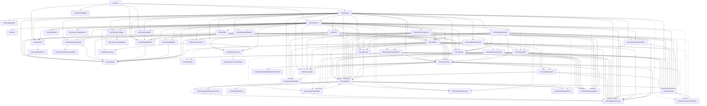
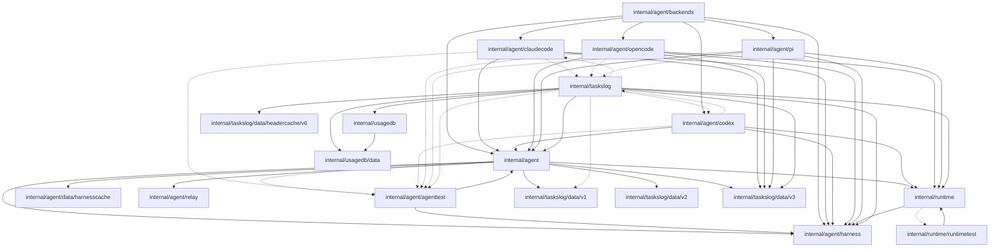
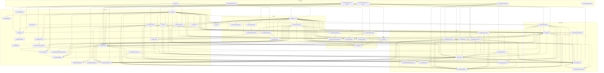

# Backend Architecture

This document maps direct Go package dependencies in `backend/`.

<!-- BEGIN GENERATED PACKAGE DEPENDENCIES -->

## Generated Package Dependencies

This section is generated by `scripts/update_backend_architecture.py`.
It uses production and test package imports from `go list -json ./backend/...`.

Arrows point from the importing package to the package it imports. Dashed
arrows are test-only imports. External dependencies are omitted.

## Runtime Spine

```mermaid
graph TD
  pkg_cmd_caic["cmd/caic"]
  pkg_frontend["frontend"]
  pkg_internal_agent["internal/agent"]
  pkg_internal_agent_agenttest["internal/agent/agenttest"]
  pkg_internal_agent_backends["internal/agent/backends"]
  pkg_internal_agent_claudecode["internal/agent/claudecode"]
  pkg_internal_agent_codex["internal/agent/codex"]
  pkg_internal_agent_data_harnesscache["internal/agent/data/harnesscache"]
  pkg_internal_agent_harness["internal/agent/harness"]
  pkg_internal_agent_opencode["internal/agent/opencode"]
  pkg_internal_agent_pi["internal/agent/pi"]
  pkg_internal_agent_relay["internal/agent/relay"]
  pkg_internal_app["internal/app"]
  pkg_internal_app_data["internal/app/data"]
  pkg_internal_auth["internal/auth"]
  pkg_internal_auth_data_v1["internal/auth/data/v1"]
  pkg_internal_autoupdate["internal/autoupdate"]
  pkg_internal_bot["internal/bot"]
  pkg_internal_ci["internal/ci"]
  pkg_internal_config_data["internal/config/data"]
  pkg_internal_forge["internal/forge"]
  pkg_internal_forge_forgecache["internal/forge/forgecache"]
  pkg_internal_forge_forgecache_data["internal/forge/forgecache/data"]
  pkg_internal_forge_forgemgr["internal/forge/forgemgr"]
  pkg_internal_forge_github["internal/forge/github"]
  pkg_internal_forge_gitlab["internal/forge/gitlab"]
  pkg_internal_httplog["internal/httplog"]
  pkg_internal_logtest["internal/logtest"]
  pkg_internal_preferences["internal/preferences"]
  pkg_internal_preferences_data_v1["internal/preferences/data/v1"]
  pkg_internal_repo["internal/repo"]
  pkg_internal_runtime["internal/runtime"]
  pkg_internal_runtime_mdruntime["internal/runtime/mdruntime"]
  pkg_internal_runtime_runtimetest["internal/runtime/runtimetest"]
  pkg_internal_server["internal/server"]
  pkg_internal_server_api["internal/server/api"]
  pkg_internal_server_api_v1["internal/server/api/v1"]
  pkg_internal_server_apiconv["internal/server/apiconv"]
  pkg_internal_server_data_audit["internal/server/data/audit"]
  pkg_internal_server_ipgeo["internal/server/ipgeo"]
  pkg_internal_server_ipgeo_data["internal/server/ipgeo/data"]
  pkg_internal_task["internal/task"]
  pkg_internal_task_taskmgr["internal/task/taskmgr"]
  pkg_internal_taskslog["internal/taskslog"]
  pkg_internal_taskslog_data_headercache_v6["internal/taskslog/data/headercache/v6"]
  pkg_internal_taskslog_data_v1["internal/taskslog/data/v1"]
  pkg_internal_taskslog_data_v2["internal/taskslog/data/v2"]
  pkg_internal_taskslog_data_v3["internal/taskslog/data/v3"]
  pkg_internal_usage["internal/usage"]
  pkg_internal_usagedb["internal/usagedb"]
  pkg_internal_usagedb_data["internal/usagedb/data"]

  pkg_cmd_caic --> pkg_internal_app
  pkg_cmd_caic --> pkg_internal_auth
  pkg_cmd_caic --> pkg_internal_autoupdate
  pkg_cmd_caic --> pkg_internal_config_data
  pkg_cmd_caic --> pkg_internal_forge_github
  pkg_cmd_caic --> pkg_internal_server
  pkg_internal_agent --> pkg_internal_agent_data_harnesscache
  pkg_internal_agent --> pkg_internal_agent_harness
  pkg_internal_agent --> pkg_internal_agent_relay
  pkg_internal_agent --> pkg_internal_runtime
  pkg_internal_agent --> pkg_internal_taskslog_data_v1
  pkg_internal_agent --> pkg_internal_taskslog_data_v2
  pkg_internal_agent --> pkg_internal_taskslog_data_v3
  pkg_internal_agent -.-> pkg_internal_agent_agenttest
  pkg_internal_agent_agenttest --> pkg_internal_agent
  pkg_internal_agent_agenttest --> pkg_internal_agent_harness
  pkg_internal_agent_backends --> pkg_internal_agent
  pkg_internal_agent_backends --> pkg_internal_agent_claudecode
  pkg_internal_agent_backends --> pkg_internal_agent_codex
  pkg_internal_agent_backends --> pkg_internal_agent_harness
  pkg_internal_agent_backends --> pkg_internal_agent_opencode
  pkg_internal_agent_backends --> pkg_internal_agent_pi
  pkg_internal_agent_claudecode --> pkg_internal_agent
  pkg_internal_agent_claudecode --> pkg_internal_agent_harness
  pkg_internal_agent_claudecode --> pkg_internal_taskslog_data_v3
  pkg_internal_agent_claudecode -.-> pkg_internal_agent_agenttest
  pkg_internal_agent_claudecode -.-> pkg_internal_taskslog
  pkg_internal_agent_codex --> pkg_internal_agent
  pkg_internal_agent_codex --> pkg_internal_agent_harness
  pkg_internal_agent_codex --> pkg_internal_runtime
  pkg_internal_agent_codex -.-> pkg_internal_agent_agenttest
  pkg_internal_agent_codex -.-> pkg_internal_taskslog
  pkg_internal_agent_opencode --> pkg_internal_agent
  pkg_internal_agent_opencode --> pkg_internal_agent_harness
  pkg_internal_agent_opencode --> pkg_internal_runtime
  pkg_internal_agent_opencode --> pkg_internal_taskslog_data_v3
  pkg_internal_agent_opencode -.-> pkg_internal_agent_agenttest
  pkg_internal_agent_opencode -.-> pkg_internal_taskslog
  pkg_internal_agent_pi --> pkg_internal_agent
  pkg_internal_agent_pi --> pkg_internal_agent_harness
  pkg_internal_agent_pi --> pkg_internal_runtime
  pkg_internal_agent_pi --> pkg_internal_taskslog_data_v3
  pkg_internal_agent_pi -.-> pkg_internal_agent_agenttest
  pkg_internal_agent_pi -.-> pkg_internal_taskslog
  pkg_internal_app --> pkg_internal_agent
  pkg_internal_app --> pkg_internal_agent_backends
  pkg_internal_app --> pkg_internal_agent_harness
  pkg_internal_app --> pkg_internal_app_data
  pkg_internal_app --> pkg_internal_auth
  pkg_internal_app --> pkg_internal_autoupdate
  pkg_internal_app --> pkg_internal_bot
  pkg_internal_app --> pkg_internal_ci
  pkg_internal_app --> pkg_internal_forge
  pkg_internal_app --> pkg_internal_forge_forgecache
  pkg_internal_app --> pkg_internal_forge_forgemgr
  pkg_internal_app --> pkg_internal_forge_github
  pkg_internal_app --> pkg_internal_preferences
  pkg_internal_app --> pkg_internal_repo
  pkg_internal_app --> pkg_internal_runtime
  pkg_internal_app --> pkg_internal_runtime_mdruntime
  pkg_internal_app --> pkg_internal_server
  pkg_internal_app --> pkg_internal_server_ipgeo
  pkg_internal_app --> pkg_internal_task
  pkg_internal_app --> pkg_internal_task_taskmgr
  pkg_internal_app --> pkg_internal_taskslog
  pkg_internal_app --> pkg_internal_usage
  pkg_internal_app --> pkg_internal_usagedb
  pkg_internal_app --> pkg_internal_usagedb_data
  pkg_internal_app -.-> pkg_internal_runtime_runtimetest
  pkg_internal_app -.-> pkg_internal_server_api_v1
  pkg_internal_app -.-> pkg_internal_taskslog_data_v1
  pkg_internal_auth --> pkg_internal_auth_data_v1
  pkg_internal_autoupdate --> pkg_internal_forge_github
  pkg_internal_bot --> pkg_internal_forge
  pkg_internal_bot --> pkg_internal_task
  pkg_internal_ci --> pkg_internal_agent
  pkg_internal_ci --> pkg_internal_auth
  pkg_internal_ci --> pkg_internal_forge
  pkg_internal_ci --> pkg_internal_forge_forgecache
  pkg_internal_ci --> pkg_internal_preferences
  pkg_internal_ci --> pkg_internal_repo
  pkg_internal_ci --> pkg_internal_runtime
  pkg_internal_ci --> pkg_internal_task
  pkg_internal_ci --> pkg_internal_taskslog
  pkg_internal_ci -.-> pkg_internal_forge_github
  pkg_internal_forge_forgecache --> pkg_internal_forge
  pkg_internal_forge_forgecache --> pkg_internal_forge_forgecache_data
  pkg_internal_forge_forgemgr --> pkg_internal_forge
  pkg_internal_forge_forgemgr --> pkg_internal_forge_github
  pkg_internal_forge_forgemgr --> pkg_internal_forge_gitlab
  pkg_internal_forge_forgemgr --> pkg_internal_repo
  pkg_internal_forge_github --> pkg_internal_forge
  pkg_internal_forge_gitlab --> pkg_internal_forge
  pkg_internal_preferences --> pkg_internal_preferences_data_v1
  pkg_internal_repo --> pkg_internal_forge
  pkg_internal_repo --> pkg_internal_runtime
  pkg_internal_repo --> pkg_internal_taskslog_data_v3
  pkg_internal_repo -.-> pkg_internal_logtest
  pkg_internal_repo -.-> pkg_internal_runtime_runtimetest
  pkg_internal_runtime --> pkg_internal_agent_harness
  pkg_internal_runtime -.-> pkg_internal_runtime_runtimetest
  pkg_internal_runtime_mdruntime --> pkg_internal_agent_harness
  pkg_internal_runtime_mdruntime --> pkg_internal_runtime
  pkg_internal_runtime_runtimetest --> pkg_internal_runtime
  pkg_internal_server --> pkg_frontend
  pkg_internal_server --> pkg_internal_agent
  pkg_internal_server --> pkg_internal_agent_harness
  pkg_internal_server --> pkg_internal_auth
  pkg_internal_server --> pkg_internal_autoupdate
  pkg_internal_server --> pkg_internal_bot
  pkg_internal_server --> pkg_internal_ci
  pkg_internal_server --> pkg_internal_forge
  pkg_internal_server --> pkg_internal_forge_forgecache
  pkg_internal_server --> pkg_internal_forge_forgemgr
  pkg_internal_server --> pkg_internal_forge_github
  pkg_internal_server --> pkg_internal_forge_gitlab
  pkg_internal_server --> pkg_internal_httplog
  pkg_internal_server --> pkg_internal_preferences
  pkg_internal_server --> pkg_internal_repo
  pkg_internal_server --> pkg_internal_runtime
  pkg_internal_server --> pkg_internal_runtime_mdruntime
  pkg_internal_server --> pkg_internal_server_api
  pkg_internal_server --> pkg_internal_server_api_v1
  pkg_internal_server --> pkg_internal_server_apiconv
  pkg_internal_server --> pkg_internal_server_data_audit
  pkg_internal_server --> pkg_internal_server_ipgeo
  pkg_internal_server --> pkg_internal_task
  pkg_internal_server --> pkg_internal_task_taskmgr
  pkg_internal_server --> pkg_internal_taskslog
  pkg_internal_server --> pkg_internal_usage
  pkg_internal_server --> pkg_internal_usagedb
  pkg_internal_server -.-> pkg_internal_agent_agenttest
  pkg_internal_server -.-> pkg_internal_agent_claudecode
  pkg_internal_server -.-> pkg_internal_agent_pi
  pkg_internal_server -.-> pkg_internal_runtime_runtimetest
  pkg_internal_server -.-> pkg_internal_taskslog_data_v1
  pkg_internal_server -.-> pkg_internal_taskslog_data_v3
  pkg_internal_server -.-> pkg_internal_usagedb_data
  pkg_internal_server_api_v1 --> pkg_internal_preferences
  pkg_internal_server_api_v1 --> pkg_internal_server_api
  pkg_internal_server_apiconv --> pkg_internal_agent
  pkg_internal_server_apiconv --> pkg_internal_agent_harness
  pkg_internal_server_apiconv --> pkg_internal_forge
  pkg_internal_server_apiconv --> pkg_internal_repo
  pkg_internal_server_apiconv --> pkg_internal_runtime
  pkg_internal_server_apiconv --> pkg_internal_server_api_v1
  pkg_internal_server_apiconv --> pkg_internal_task
  pkg_internal_server_apiconv --> pkg_internal_taskslog
  pkg_internal_server_apiconv --> pkg_internal_taskslog_data_v3
  pkg_internal_server_apiconv --> pkg_internal_usage
  pkg_internal_server_apiconv --> pkg_internal_usagedb
  pkg_internal_server_apiconv --> pkg_internal_usagedb_data
  pkg_internal_server_ipgeo --> pkg_internal_server_ipgeo_data
  pkg_internal_task --> pkg_internal_agent
  pkg_internal_task --> pkg_internal_agent_harness
  pkg_internal_task --> pkg_internal_forge
  pkg_internal_task --> pkg_internal_repo
  pkg_internal_task --> pkg_internal_runtime
  pkg_internal_task --> pkg_internal_taskslog
  pkg_internal_task --> pkg_internal_taskslog_data_v3
  pkg_internal_task --> pkg_internal_usage
  pkg_internal_task --> pkg_internal_usagedb
  pkg_internal_task --> pkg_internal_usagedb_data
  pkg_internal_task -.-> pkg_internal_agent_agenttest
  pkg_internal_task -.-> pkg_internal_agent_claudecode
  pkg_internal_task -.-> pkg_internal_logtest
  pkg_internal_task -.-> pkg_internal_runtime_runtimetest
  pkg_internal_task -.-> pkg_internal_taskslog_data_v1
  pkg_internal_task_taskmgr --> pkg_internal_agent
  pkg_internal_task_taskmgr --> pkg_internal_agent_harness
  pkg_internal_task_taskmgr --> pkg_internal_repo
  pkg_internal_task_taskmgr --> pkg_internal_runtime
  pkg_internal_task_taskmgr --> pkg_internal_task
  pkg_internal_task_taskmgr --> pkg_internal_taskslog
  pkg_internal_task_taskmgr --> pkg_internal_taskslog_data_v3
  pkg_internal_task_taskmgr --> pkg_internal_usage
  pkg_internal_task_taskmgr -.-> pkg_internal_agent_agenttest
  pkg_internal_task_taskmgr -.-> pkg_internal_agent_claudecode
  pkg_internal_task_taskmgr -.-> pkg_internal_agent_codex
  pkg_internal_task_taskmgr -.-> pkg_internal_agent_opencode
  pkg_internal_task_taskmgr -.-> pkg_internal_agent_pi
  pkg_internal_task_taskmgr -.-> pkg_internal_runtime_mdruntime
  pkg_internal_task_taskmgr -.-> pkg_internal_runtime_runtimetest
  pkg_internal_task_taskmgr -.-> pkg_internal_taskslog_data_v1
  pkg_internal_task_taskmgr -.-> pkg_internal_taskslog_data_v2
  pkg_internal_taskslog --> pkg_internal_agent
  pkg_internal_taskslog --> pkg_internal_agent_harness
  pkg_internal_taskslog --> pkg_internal_runtime
  pkg_internal_taskslog --> pkg_internal_taskslog_data_headercache_v6
  pkg_internal_taskslog --> pkg_internal_taskslog_data_v3
  pkg_internal_taskslog --> pkg_internal_usagedb
  pkg_internal_taskslog --> pkg_internal_usagedb_data
  pkg_internal_taskslog -.-> pkg_internal_agent_agenttest
  pkg_internal_taskslog -.-> pkg_internal_agent_claudecode
  pkg_internal_taskslog -.-> pkg_internal_agent_codex
  pkg_internal_taskslog -.-> pkg_internal_taskslog_data_v1
  pkg_internal_usage --> pkg_internal_agent
  pkg_internal_usagedb --> pkg_internal_usagedb_data
```

## Agent Backends

```mermaid
graph TD
  pkg_internal_agent["internal/agent"]
  pkg_internal_agent_agenttest["internal/agent/agenttest"]
  pkg_internal_agent_backends["internal/agent/backends"]
  pkg_internal_agent_claudecode["internal/agent/claudecode"]
  pkg_internal_agent_codex["internal/agent/codex"]
  pkg_internal_agent_data_harnesscache["internal/agent/data/harnesscache"]
  pkg_internal_agent_harness["internal/agent/harness"]
  pkg_internal_agent_opencode["internal/agent/opencode"]
  pkg_internal_agent_pi["internal/agent/pi"]
  pkg_internal_agent_relay["internal/agent/relay"]
  pkg_internal_runtime["internal/runtime"]
  pkg_internal_runtime_runtimetest["internal/runtime/runtimetest"]
  pkg_internal_taskslog["internal/taskslog"]
  pkg_internal_taskslog_data_headercache_v6["internal/taskslog/data/headercache/v6"]
  pkg_internal_taskslog_data_v1["internal/taskslog/data/v1"]
  pkg_internal_taskslog_data_v2["internal/taskslog/data/v2"]
  pkg_internal_taskslog_data_v3["internal/taskslog/data/v3"]
  pkg_internal_usagedb["internal/usagedb"]
  pkg_internal_usagedb_data["internal/usagedb/data"]

  pkg_internal_agent --> pkg_internal_agent_data_harnesscache
  pkg_internal_agent --> pkg_internal_agent_harness
  pkg_internal_agent --> pkg_internal_agent_relay
  pkg_internal_agent --> pkg_internal_runtime
  pkg_internal_agent --> pkg_internal_taskslog_data_v1
  pkg_internal_agent --> pkg_internal_taskslog_data_v2
  pkg_internal_agent --> pkg_internal_taskslog_data_v3
  pkg_internal_agent -.-> pkg_internal_agent_agenttest
  pkg_internal_agent_agenttest --> pkg_internal_agent
  pkg_internal_agent_agenttest --> pkg_internal_agent_harness
  pkg_internal_agent_backends --> pkg_internal_agent
  pkg_internal_agent_backends --> pkg_internal_agent_claudecode
  pkg_internal_agent_backends --> pkg_internal_agent_codex
  pkg_internal_agent_backends --> pkg_internal_agent_harness
  pkg_internal_agent_backends --> pkg_internal_agent_opencode
  pkg_internal_agent_backends --> pkg_internal_agent_pi
  pkg_internal_agent_claudecode --> pkg_internal_agent
  pkg_internal_agent_claudecode --> pkg_internal_agent_harness
  pkg_internal_agent_claudecode --> pkg_internal_taskslog_data_v3
  pkg_internal_agent_claudecode -.-> pkg_internal_agent_agenttest
  pkg_internal_agent_claudecode -.-> pkg_internal_taskslog
  pkg_internal_agent_codex --> pkg_internal_agent
  pkg_internal_agent_codex --> pkg_internal_agent_harness
  pkg_internal_agent_codex --> pkg_internal_runtime
  pkg_internal_agent_codex -.-> pkg_internal_agent_agenttest
  pkg_internal_agent_codex -.-> pkg_internal_taskslog
  pkg_internal_agent_opencode --> pkg_internal_agent
  pkg_internal_agent_opencode --> pkg_internal_agent_harness
  pkg_internal_agent_opencode --> pkg_internal_runtime
  pkg_internal_agent_opencode --> pkg_internal_taskslog_data_v3
  pkg_internal_agent_opencode -.-> pkg_internal_agent_agenttest
  pkg_internal_agent_opencode -.-> pkg_internal_taskslog
  pkg_internal_agent_pi --> pkg_internal_agent
  pkg_internal_agent_pi --> pkg_internal_agent_harness
  pkg_internal_agent_pi --> pkg_internal_runtime
  pkg_internal_agent_pi --> pkg_internal_taskslog_data_v3
  pkg_internal_agent_pi -.-> pkg_internal_agent_agenttest
  pkg_internal_agent_pi -.-> pkg_internal_taskslog
  pkg_internal_runtime --> pkg_internal_agent_harness
  pkg_internal_runtime -.-> pkg_internal_runtime_runtimetest
  pkg_internal_runtime_runtimetest --> pkg_internal_runtime
  pkg_internal_taskslog --> pkg_internal_agent
  pkg_internal_taskslog --> pkg_internal_agent_harness
  pkg_internal_taskslog --> pkg_internal_runtime
  pkg_internal_taskslog --> pkg_internal_taskslog_data_headercache_v6
  pkg_internal_taskslog --> pkg_internal_taskslog_data_v3
  pkg_internal_taskslog --> pkg_internal_usagedb
  pkg_internal_taskslog --> pkg_internal_usagedb_data
  pkg_internal_taskslog -.-> pkg_internal_agent_agenttest
  pkg_internal_taskslog -.-> pkg_internal_agent_claudecode
  pkg_internal_taskslog -.-> pkg_internal_agent_codex
  pkg_internal_taskslog -.-> pkg_internal_taskslog_data_v1
  pkg_internal_usagedb --> pkg_internal_usagedb_data
```

## Complete Package Import Graph

```mermaid
graph TD
  subgraph Commands["Commands"]
    pkg_cmd_caic["cmd/caic"]
    pkg_internal_cmd_check_agent_logs["internal/cmd/check-agent-logs"]
    pkg_internal_cmd_gen_api_sdk["internal/cmd/gen-api-sdk"]
    pkg_internal_cmd_mcp_auth_smoke["internal/cmd/mcp-auth-smoke"]
    pkg_internal_cmd_record_trace["internal/cmd/record-trace"]
    pkg_internal_cmd_upnp_dump["internal/cmd/upnp-dump"]
  end

  subgraph Static_Assets["Static Assets"]
    pkg_frontend["frontend"]
  end

  subgraph Agent["Agent"]
    pkg_internal_agent["internal/agent"]
    pkg_internal_agent_agenttest["internal/agent/agenttest"]
    pkg_internal_agent_backends["internal/agent/backends"]
    pkg_internal_agent_claudecode["internal/agent/claudecode"]
    pkg_internal_agent_codex["internal/agent/codex"]
    pkg_internal_agent_data_harnesscache["internal/agent/data/harnesscache"]
    pkg_internal_agent_harness["internal/agent/harness"]
    pkg_internal_agent_opencode["internal/agent/opencode"]
    pkg_internal_agent_pi["internal/agent/pi"]
    pkg_internal_agent_relay["internal/agent/relay"]
  end

  subgraph Forge["Forge"]
    pkg_internal_forge["internal/forge"]
    pkg_internal_forge_forgecache["internal/forge/forgecache"]
    pkg_internal_forge_forgecache_data["internal/forge/forgecache/data"]
    pkg_internal_forge_forgemgr["internal/forge/forgemgr"]
    pkg_internal_forge_github["internal/forge/github"]
    pkg_internal_forge_gitlab["internal/forge/gitlab"]
  end

  subgraph Router["Router"]
    pkg_internal_server["internal/server"]
    pkg_internal_server_api["internal/server/api"]
    pkg_internal_server_api_v1["internal/server/api/v1"]
    pkg_internal_server_apiconv["internal/server/apiconv"]
    pkg_internal_server_data_audit["internal/server/data/audit"]
    pkg_internal_server_ipgeo["internal/server/ipgeo"]
    pkg_internal_server_ipgeo_data["internal/server/ipgeo/data"]
  end

  subgraph Task_Runtime["Task Runtime"]
    pkg_internal_runtime["internal/runtime"]
    pkg_internal_runtime_mdruntime["internal/runtime/mdruntime"]
    pkg_internal_runtime_runtimetest["internal/runtime/runtimetest"]
    pkg_internal_task["internal/task"]
    pkg_internal_task_taskmgr["internal/task/taskmgr"]
  end

  subgraph Repo["Repo"]
    pkg_internal_repo["internal/repo"]
  end

  subgraph Support["Support"]
    pkg_internal_agents_antigravity["internal/agents/antigravity"]
    pkg_internal_app["internal/app"]
    pkg_internal_app_data["internal/app/data"]
    pkg_internal_auth["internal/auth"]
    pkg_internal_auth_data_v1["internal/auth/data/v1"]
    pkg_internal_autoupdate["internal/autoupdate"]
    pkg_internal_bot["internal/bot"]
    pkg_internal_ci["internal/ci"]
    pkg_internal_config_data["internal/config/data"]
    pkg_internal_httplog["internal/httplog"]
    pkg_internal_logtest["internal/logtest"]
    pkg_internal_preferences["internal/preferences"]
    pkg_internal_preferences_data_v1["internal/preferences/data/v1"]
    pkg_internal_smoketest["internal/smoketest"]
    pkg_internal_taskslog["internal/taskslog"]
    pkg_internal_taskslog_data_headercache_v6["internal/taskslog/data/headercache/v6"]
    pkg_internal_taskslog_data_v1["internal/taskslog/data/v1"]
    pkg_internal_taskslog_data_v2["internal/taskslog/data/v2"]
    pkg_internal_taskslog_data_v3["internal/taskslog/data/v3"]
    pkg_internal_usage["internal/usage"]
    pkg_internal_usagedb["internal/usagedb"]
    pkg_internal_usagedb_data["internal/usagedb/data"]
  end

  pkg_cmd_caic --> pkg_internal_app
  pkg_cmd_caic --> pkg_internal_auth
  pkg_cmd_caic --> pkg_internal_autoupdate
  pkg_cmd_caic --> pkg_internal_config_data
  pkg_cmd_caic --> pkg_internal_forge_github
  pkg_cmd_caic --> pkg_internal_server
  pkg_internal_agent --> pkg_internal_agent_data_harnesscache
  pkg_internal_agent --> pkg_internal_agent_harness
  pkg_internal_agent --> pkg_internal_agent_relay
  pkg_internal_agent --> pkg_internal_runtime
  pkg_internal_agent --> pkg_internal_taskslog_data_v1
  pkg_internal_agent --> pkg_internal_taskslog_data_v2
  pkg_internal_agent --> pkg_internal_taskslog_data_v3
  pkg_internal_agent -.-> pkg_internal_agent_agenttest
  pkg_internal_agent_agenttest --> pkg_internal_agent
  pkg_internal_agent_agenttest --> pkg_internal_agent_harness
  pkg_internal_agent_backends --> pkg_internal_agent
  pkg_internal_agent_backends --> pkg_internal_agent_claudecode
  pkg_internal_agent_backends --> pkg_internal_agent_codex
  pkg_internal_agent_backends --> pkg_internal_agent_harness
  pkg_internal_agent_backends --> pkg_internal_agent_opencode
  pkg_internal_agent_backends --> pkg_internal_agent_pi
  pkg_internal_agent_claudecode --> pkg_internal_agent
  pkg_internal_agent_claudecode --> pkg_internal_agent_harness
  pkg_internal_agent_claudecode --> pkg_internal_taskslog_data_v3
  pkg_internal_agent_claudecode -.-> pkg_internal_agent_agenttest
  pkg_internal_agent_claudecode -.-> pkg_internal_taskslog
  pkg_internal_agent_codex --> pkg_internal_agent
  pkg_internal_agent_codex --> pkg_internal_agent_harness
  pkg_internal_agent_codex --> pkg_internal_runtime
  pkg_internal_agent_codex -.-> pkg_internal_agent_agenttest
  pkg_internal_agent_codex -.-> pkg_internal_taskslog
  pkg_internal_agent_opencode --> pkg_internal_agent
  pkg_internal_agent_opencode --> pkg_internal_agent_harness
  pkg_internal_agent_opencode --> pkg_internal_runtime
  pkg_internal_agent_opencode --> pkg_internal_taskslog_data_v3
  pkg_internal_agent_opencode -.-> pkg_internal_agent_agenttest
  pkg_internal_agent_opencode -.-> pkg_internal_taskslog
  pkg_internal_agent_pi --> pkg_internal_agent
  pkg_internal_agent_pi --> pkg_internal_agent_harness
  pkg_internal_agent_pi --> pkg_internal_runtime
  pkg_internal_agent_pi --> pkg_internal_taskslog_data_v3
  pkg_internal_agent_pi -.-> pkg_internal_agent_agenttest
  pkg_internal_agent_pi -.-> pkg_internal_taskslog
  pkg_internal_agents_antigravity --> pkg_internal_agent
  pkg_internal_agents_antigravity --> pkg_internal_agent_harness
  pkg_internal_agents_antigravity --> pkg_internal_runtime
  pkg_internal_agents_antigravity -.-> pkg_internal_agent_agenttest
  pkg_internal_agents_antigravity -.-> pkg_internal_taskslog_data_v3
  pkg_internal_app --> pkg_internal_agent
  pkg_internal_app --> pkg_internal_agent_backends
  pkg_internal_app --> pkg_internal_agent_harness
  pkg_internal_app --> pkg_internal_app_data
  pkg_internal_app --> pkg_internal_auth
  pkg_internal_app --> pkg_internal_autoupdate
  pkg_internal_app --> pkg_internal_bot
  pkg_internal_app --> pkg_internal_ci
  pkg_internal_app --> pkg_internal_forge
  pkg_internal_app --> pkg_internal_forge_forgecache
  pkg_internal_app --> pkg_internal_forge_forgemgr
  pkg_internal_app --> pkg_internal_forge_github
  pkg_internal_app --> pkg_internal_preferences
  pkg_internal_app --> pkg_internal_repo
  pkg_internal_app --> pkg_internal_runtime
  pkg_internal_app --> pkg_internal_runtime_mdruntime
  pkg_internal_app --> pkg_internal_server
  pkg_internal_app --> pkg_internal_server_ipgeo
  pkg_internal_app --> pkg_internal_task
  pkg_internal_app --> pkg_internal_task_taskmgr
  pkg_internal_app --> pkg_internal_taskslog
  pkg_internal_app --> pkg_internal_usage
  pkg_internal_app --> pkg_internal_usagedb
  pkg_internal_app --> pkg_internal_usagedb_data
  pkg_internal_app -.-> pkg_internal_runtime_runtimetest
  pkg_internal_app -.-> pkg_internal_server_api_v1
  pkg_internal_app -.-> pkg_internal_taskslog_data_v1
  pkg_internal_auth --> pkg_internal_auth_data_v1
  pkg_internal_autoupdate --> pkg_internal_forge_github
  pkg_internal_bot --> pkg_internal_forge
  pkg_internal_bot --> pkg_internal_task
  pkg_internal_ci --> pkg_internal_agent
  pkg_internal_ci --> pkg_internal_auth
  pkg_internal_ci --> pkg_internal_forge
  pkg_internal_ci --> pkg_internal_forge_forgecache
  pkg_internal_ci --> pkg_internal_preferences
  pkg_internal_ci --> pkg_internal_repo
  pkg_internal_ci --> pkg_internal_runtime
  pkg_internal_ci --> pkg_internal_task
  pkg_internal_ci --> pkg_internal_taskslog
  pkg_internal_ci -.-> pkg_internal_forge_github
  pkg_internal_cmd_check_agent_logs --> pkg_internal_agent
  pkg_internal_cmd_check_agent_logs --> pkg_internal_agent_opencode
  pkg_internal_cmd_check_agent_logs --> pkg_internal_taskslog_data_v1
  pkg_internal_cmd_gen_api_sdk --> pkg_internal_server_api_v1
  pkg_internal_cmd_mcp_auth_smoke --> pkg_internal_auth
  pkg_internal_cmd_mcp_auth_smoke --> pkg_internal_ci
  pkg_internal_cmd_mcp_auth_smoke --> pkg_internal_forge_forgemgr
  pkg_internal_cmd_mcp_auth_smoke --> pkg_internal_preferences
  pkg_internal_cmd_mcp_auth_smoke --> pkg_internal_repo
  pkg_internal_cmd_mcp_auth_smoke --> pkg_internal_runtime
  pkg_internal_cmd_mcp_auth_smoke --> pkg_internal_server
  pkg_internal_cmd_mcp_auth_smoke --> pkg_internal_server_ipgeo
  pkg_internal_cmd_mcp_auth_smoke --> pkg_internal_smoketest
  pkg_internal_cmd_mcp_auth_smoke --> pkg_internal_task
  pkg_internal_cmd_mcp_auth_smoke --> pkg_internal_task_taskmgr
  pkg_internal_cmd_mcp_auth_smoke --> pkg_internal_taskslog
  pkg_internal_cmd_mcp_auth_smoke --> pkg_internal_usagedb
  pkg_internal_cmd_record_trace --> pkg_internal_agent
  pkg_internal_cmd_record_trace --> pkg_internal_agent_claudecode
  pkg_internal_cmd_record_trace --> pkg_internal_agent_codex
  pkg_internal_cmd_record_trace --> pkg_internal_agent_harness
  pkg_internal_cmd_record_trace --> pkg_internal_agent_opencode
  pkg_internal_cmd_record_trace --> pkg_internal_agent_pi
  pkg_internal_cmd_record_trace --> pkg_internal_taskslog
  pkg_internal_cmd_record_trace --> pkg_internal_taskslog_data_v3
  pkg_internal_forge_forgecache --> pkg_internal_forge
  pkg_internal_forge_forgecache --> pkg_internal_forge_forgecache_data
  pkg_internal_forge_forgemgr --> pkg_internal_forge
  pkg_internal_forge_forgemgr --> pkg_internal_forge_github
  pkg_internal_forge_forgemgr --> pkg_internal_forge_gitlab
  pkg_internal_forge_forgemgr --> pkg_internal_repo
  pkg_internal_forge_github --> pkg_internal_forge
  pkg_internal_forge_gitlab --> pkg_internal_forge
  pkg_internal_preferences --> pkg_internal_preferences_data_v1
  pkg_internal_repo --> pkg_internal_forge
  pkg_internal_repo --> pkg_internal_runtime
  pkg_internal_repo --> pkg_internal_taskslog_data_v3
  pkg_internal_repo -.-> pkg_internal_logtest
  pkg_internal_repo -.-> pkg_internal_runtime_runtimetest
  pkg_internal_runtime --> pkg_internal_agent_harness
  pkg_internal_runtime -.-> pkg_internal_runtime_runtimetest
  pkg_internal_runtime_mdruntime --> pkg_internal_agent_harness
  pkg_internal_runtime_mdruntime --> pkg_internal_runtime
  pkg_internal_runtime_runtimetest --> pkg_internal_runtime
  pkg_internal_server --> pkg_frontend
  pkg_internal_server --> pkg_internal_agent
  pkg_internal_server --> pkg_internal_agent_harness
  pkg_internal_server --> pkg_internal_auth
  pkg_internal_server --> pkg_internal_autoupdate
  pkg_internal_server --> pkg_internal_bot
  pkg_internal_server --> pkg_internal_ci
  pkg_internal_server --> pkg_internal_forge
  pkg_internal_server --> pkg_internal_forge_forgecache
  pkg_internal_server --> pkg_internal_forge_forgemgr
  pkg_internal_server --> pkg_internal_forge_github
  pkg_internal_server --> pkg_internal_forge_gitlab
  pkg_internal_server --> pkg_internal_httplog
  pkg_internal_server --> pkg_internal_preferences
  pkg_internal_server --> pkg_internal_repo
  pkg_internal_server --> pkg_internal_runtime
  pkg_internal_server --> pkg_internal_runtime_mdruntime
  pkg_internal_server --> pkg_internal_server_api
  pkg_internal_server --> pkg_internal_server_api_v1
  pkg_internal_server --> pkg_internal_server_apiconv
  pkg_internal_server --> pkg_internal_server_data_audit
  pkg_internal_server --> pkg_internal_server_ipgeo
  pkg_internal_server --> pkg_internal_task
  pkg_internal_server --> pkg_internal_task_taskmgr
  pkg_internal_server --> pkg_internal_taskslog
  pkg_internal_server --> pkg_internal_usage
  pkg_internal_server --> pkg_internal_usagedb
  pkg_internal_server -.-> pkg_internal_agent_agenttest
  pkg_internal_server -.-> pkg_internal_agent_claudecode
  pkg_internal_server -.-> pkg_internal_agent_pi
  pkg_internal_server -.-> pkg_internal_runtime_runtimetest
  pkg_internal_server -.-> pkg_internal_taskslog_data_v1
  pkg_internal_server -.-> pkg_internal_taskslog_data_v3
  pkg_internal_server -.-> pkg_internal_usagedb_data
  pkg_internal_server_api_v1 --> pkg_internal_preferences
  pkg_internal_server_api_v1 --> pkg_internal_server_api
  pkg_internal_server_apiconv --> pkg_internal_agent
  pkg_internal_server_apiconv --> pkg_internal_agent_harness
  pkg_internal_server_apiconv --> pkg_internal_forge
  pkg_internal_server_apiconv --> pkg_internal_repo
  pkg_internal_server_apiconv --> pkg_internal_runtime
  pkg_internal_server_apiconv --> pkg_internal_server_api_v1
  pkg_internal_server_apiconv --> pkg_internal_task
  pkg_internal_server_apiconv --> pkg_internal_taskslog
  pkg_internal_server_apiconv --> pkg_internal_taskslog_data_v3
  pkg_internal_server_apiconv --> pkg_internal_usage
  pkg_internal_server_apiconv --> pkg_internal_usagedb
  pkg_internal_server_apiconv --> pkg_internal_usagedb_data
  pkg_internal_server_ipgeo --> pkg_internal_server_ipgeo_data
  pkg_internal_smoketest --> pkg_internal_agent
  pkg_internal_smoketest --> pkg_internal_agent_harness
  pkg_internal_smoketest --> pkg_internal_forge
  pkg_internal_smoketest --> pkg_internal_runtime
  pkg_internal_smoketest --> pkg_internal_task
  pkg_internal_smoketest --> pkg_internal_taskslog
  pkg_internal_smoketest --> pkg_internal_taskslog_data_v3
  pkg_internal_smoketest --> pkg_internal_usage
  pkg_internal_task --> pkg_internal_agent
  pkg_internal_task --> pkg_internal_agent_harness
  pkg_internal_task --> pkg_internal_forge
  pkg_internal_task --> pkg_internal_repo
  pkg_internal_task --> pkg_internal_runtime
  pkg_internal_task --> pkg_internal_taskslog
  pkg_internal_task --> pkg_internal_taskslog_data_v3
  pkg_internal_task --> pkg_internal_usage
  pkg_internal_task --> pkg_internal_usagedb
  pkg_internal_task --> pkg_internal_usagedb_data
  pkg_internal_task -.-> pkg_internal_agent_agenttest
  pkg_internal_task -.-> pkg_internal_agent_claudecode
  pkg_internal_task -.-> pkg_internal_logtest
  pkg_internal_task -.-> pkg_internal_runtime_runtimetest
  pkg_internal_task -.-> pkg_internal_taskslog_data_v1
  pkg_internal_task_taskmgr --> pkg_internal_agent
  pkg_internal_task_taskmgr --> pkg_internal_agent_harness
  pkg_internal_task_taskmgr --> pkg_internal_repo
  pkg_internal_task_taskmgr --> pkg_internal_runtime
  pkg_internal_task_taskmgr --> pkg_internal_task
  pkg_internal_task_taskmgr --> pkg_internal_taskslog
  pkg_internal_task_taskmgr --> pkg_internal_taskslog_data_v3
  pkg_internal_task_taskmgr --> pkg_internal_usage
  pkg_internal_task_taskmgr -.-> pkg_internal_agent_agenttest
  pkg_internal_task_taskmgr -.-> pkg_internal_agent_claudecode
  pkg_internal_task_taskmgr -.-> pkg_internal_agent_codex
  pkg_internal_task_taskmgr -.-> pkg_internal_agent_opencode
  pkg_internal_task_taskmgr -.-> pkg_internal_agent_pi
  pkg_internal_task_taskmgr -.-> pkg_internal_runtime_mdruntime
  pkg_internal_task_taskmgr -.-> pkg_internal_runtime_runtimetest
  pkg_internal_task_taskmgr -.-> pkg_internal_taskslog_data_v1
  pkg_internal_task_taskmgr -.-> pkg_internal_taskslog_data_v2
  pkg_internal_taskslog --> pkg_internal_agent
  pkg_internal_taskslog --> pkg_internal_agent_harness
  pkg_internal_taskslog --> pkg_internal_runtime
  pkg_internal_taskslog --> pkg_internal_taskslog_data_headercache_v6
  pkg_internal_taskslog --> pkg_internal_taskslog_data_v3
  pkg_internal_taskslog --> pkg_internal_usagedb
  pkg_internal_taskslog --> pkg_internal_usagedb_data
  pkg_internal_taskslog -.-> pkg_internal_agent_agenttest
  pkg_internal_taskslog -.-> pkg_internal_agent_claudecode
  pkg_internal_taskslog -.-> pkg_internal_agent_codex
  pkg_internal_taskslog -.-> pkg_internal_taskslog_data_v1
  pkg_internal_usage --> pkg_internal_agent
  pkg_internal_usagedb --> pkg_internal_usagedb_data
```

## Package Dependencies

| Package                                 | Production backend dependencies                                                                                                                                                                                                                                                                                                                                                                                                                                                                                                                                                                                  | Test-only backend dependencies                                                                                                                                                                                                                          |
| --------------------------------------- | ---------------------------------------------------------------------------------------------------------------------------------------------------------------------------------------------------------------------------------------------------------------------------------------------------------------------------------------------------------------------------------------------------------------------------------------------------------------------------------------------------------------------------------------------------------------------------------------------------------------- | ------------------------------------------------------------------------------------------------------------------------------------------------------------------------------------------------------------------------------------------------------- |
| `cmd/caic`                              | `internal/app`, `internal/auth`, `internal/autoupdate`, `internal/config/data`, `internal/forge/github`, `internal/server`                                                                                                                                                                                                                                                                                                                                                                                                                                                                                       | None                                                                                                                                                                                                                                                    |
| `frontend`                              | None                                                                                                                                                                                                                                                                                                                                                                                                                                                                                                                                                                                                             | None                                                                                                                                                                                                                                                    |
| `internal/agent`                        | `internal/agent/data/harnesscache`, `internal/agent/harness`, `internal/agent/relay`, `internal/runtime`, `internal/taskslog/data/v1`, `internal/taskslog/data/v2`, `internal/taskslog/data/v3`                                                                                                                                                                                                                                                                                                                                                                                                                  | `internal/agent/agenttest`                                                                                                                                                                                                                              |
| `internal/agent/agenttest`              | `internal/agent`, `internal/agent/harness`                                                                                                                                                                                                                                                                                                                                                                                                                                                                                                                                                                       | None                                                                                                                                                                                                                                                    |
| `internal/agent/backends`               | `internal/agent`, `internal/agent/claudecode`, `internal/agent/codex`, `internal/agent/harness`, `internal/agent/opencode`, `internal/agent/pi`                                                                                                                                                                                                                                                                                                                                                                                                                                                                  | None                                                                                                                                                                                                                                                    |
| `internal/agent/claudecode`             | `internal/agent`, `internal/agent/harness`, `internal/taskslog/data/v3`                                                                                                                                                                                                                                                                                                                                                                                                                                                                                                                                          | `internal/agent/agenttest`, `internal/taskslog`                                                                                                                                                                                                         |
| `internal/agent/codex`                  | `internal/agent`, `internal/agent/harness`, `internal/runtime`                                                                                                                                                                                                                                                                                                                                                                                                                                                                                                                                                   | `internal/agent/agenttest`, `internal/taskslog`                                                                                                                                                                                                         |
| `internal/agent/data/harnesscache`      | None                                                                                                                                                                                                                                                                                                                                                                                                                                                                                                                                                                                                             | None                                                                                                                                                                                                                                                    |
| `internal/agent/harness`                | None                                                                                                                                                                                                                                                                                                                                                                                                                                                                                                                                                                                                             | None                                                                                                                                                                                                                                                    |
| `internal/agent/opencode`               | `internal/agent`, `internal/agent/harness`, `internal/runtime`, `internal/taskslog/data/v3`                                                                                                                                                                                                                                                                                                                                                                                                                                                                                                                      | `internal/agent/agenttest`, `internal/taskslog`                                                                                                                                                                                                         |
| `internal/agent/pi`                     | `internal/agent`, `internal/agent/harness`, `internal/runtime`, `internal/taskslog/data/v3`                                                                                                                                                                                                                                                                                                                                                                                                                                                                                                                      | `internal/agent/agenttest`, `internal/taskslog`                                                                                                                                                                                                         |
| `internal/agent/relay`                  | None                                                                                                                                                                                                                                                                                                                                                                                                                                                                                                                                                                                                             | None                                                                                                                                                                                                                                                    |
| `internal/agents/antigravity`           | `internal/agent`, `internal/agent/harness`, `internal/runtime`                                                                                                                                                                                                                                                                                                                                                                                                                                                                                                                                                   | `internal/agent/agenttest`, `internal/taskslog/data/v3`                                                                                                                                                                                                 |
| `internal/app`                          | `internal/agent`, `internal/agent/backends`, `internal/agent/harness`, `internal/app/data`, `internal/auth`, `internal/autoupdate`, `internal/bot`, `internal/ci`, `internal/forge`, `internal/forge/forgecache`, `internal/forge/forgemgr`, `internal/forge/github`, `internal/preferences`, `internal/repo`, `internal/runtime`, `internal/runtime/mdruntime`, `internal/server`, `internal/server/ipgeo`, `internal/task`, `internal/task/taskmgr`, `internal/taskslog`, `internal/usage`, `internal/usagedb`, `internal/usagedb/data`                                                                        | `internal/runtime/runtimetest`, `internal/server/api/v1`, `internal/taskslog/data/v1`                                                                                                                                                                   |
| `internal/app/data`                     | None                                                                                                                                                                                                                                                                                                                                                                                                                                                                                                                                                                                                             | None                                                                                                                                                                                                                                                    |
| `internal/auth`                         | `internal/auth/data/v1`                                                                                                                                                                                                                                                                                                                                                                                                                                                                                                                                                                                          | None                                                                                                                                                                                                                                                    |
| `internal/auth/data/v1`                 | None                                                                                                                                                                                                                                                                                                                                                                                                                                                                                                                                                                                                             | None                                                                                                                                                                                                                                                    |
| `internal/autoupdate`                   | `internal/forge/github`                                                                                                                                                                                                                                                                                                                                                                                                                                                                                                                                                                                          | None                                                                                                                                                                                                                                                    |
| `internal/bot`                          | `internal/forge`, `internal/task`                                                                                                                                                                                                                                                                                                                                                                                                                                                                                                                                                                                | None                                                                                                                                                                                                                                                    |
| `internal/ci`                           | `internal/agent`, `internal/auth`, `internal/forge`, `internal/forge/forgecache`, `internal/preferences`, `internal/repo`, `internal/runtime`, `internal/task`, `internal/taskslog`                                                                                                                                                                                                                                                                                                                                                                                                                              | `internal/forge/github`                                                                                                                                                                                                                                 |
| `internal/cmd/check-agent-logs`         | `internal/agent`, `internal/agent/opencode`, `internal/taskslog/data/v1`                                                                                                                                                                                                                                                                                                                                                                                                                                                                                                                                         | None                                                                                                                                                                                                                                                    |
| `internal/cmd/gen-api-sdk`              | `internal/server/api/v1`                                                                                                                                                                                                                                                                                                                                                                                                                                                                                                                                                                                         | None                                                                                                                                                                                                                                                    |
| `internal/cmd/mcp-auth-smoke`           | `internal/auth`, `internal/ci`, `internal/forge/forgemgr`, `internal/preferences`, `internal/repo`, `internal/runtime`, `internal/server`, `internal/server/ipgeo`, `internal/smoketest`, `internal/task`, `internal/task/taskmgr`, `internal/taskslog`, `internal/usagedb`                                                                                                                                                                                                                                                                                                                                      | None                                                                                                                                                                                                                                                    |
| `internal/cmd/record-trace`             | `internal/agent`, `internal/agent/claudecode`, `internal/agent/codex`, `internal/agent/harness`, `internal/agent/opencode`, `internal/agent/pi`, `internal/taskslog`, `internal/taskslog/data/v3`                                                                                                                                                                                                                                                                                                                                                                                                                | None                                                                                                                                                                                                                                                    |
| `internal/cmd/upnp-dump`                | None                                                                                                                                                                                                                                                                                                                                                                                                                                                                                                                                                                                                             | None                                                                                                                                                                                                                                                    |
| `internal/config/data`                  | None                                                                                                                                                                                                                                                                                                                                                                                                                                                                                                                                                                                                             | None                                                                                                                                                                                                                                                    |
| `internal/forge`                        | None                                                                                                                                                                                                                                                                                                                                                                                                                                                                                                                                                                                                             | None                                                                                                                                                                                                                                                    |
| `internal/forge/forgecache`             | `internal/forge`, `internal/forge/forgecache/data`                                                                                                                                                                                                                                                                                                                                                                                                                                                                                                                                                               | None                                                                                                                                                                                                                                                    |
| `internal/forge/forgecache/data`        | None                                                                                                                                                                                                                                                                                                                                                                                                                                                                                                                                                                                                             | None                                                                                                                                                                                                                                                    |
| `internal/forge/forgemgr`               | `internal/forge`, `internal/forge/github`, `internal/forge/gitlab`, `internal/repo`                                                                                                                                                                                                                                                                                                                                                                                                                                                                                                                              | None                                                                                                                                                                                                                                                    |
| `internal/forge/github`                 | `internal/forge`                                                                                                                                                                                                                                                                                                                                                                                                                                                                                                                                                                                                 | None                                                                                                                                                                                                                                                    |
| `internal/forge/gitlab`                 | `internal/forge`                                                                                                                                                                                                                                                                                                                                                                                                                                                                                                                                                                                                 | None                                                                                                                                                                                                                                                    |
| `internal/httplog`                      | None                                                                                                                                                                                                                                                                                                                                                                                                                                                                                                                                                                                                             | None                                                                                                                                                                                                                                                    |
| `internal/logtest`                      | None                                                                                                                                                                                                                                                                                                                                                                                                                                                                                                                                                                                                             | None                                                                                                                                                                                                                                                    |
| `internal/preferences`                  | `internal/preferences/data/v1`                                                                                                                                                                                                                                                                                                                                                                                                                                                                                                                                                                                   | None                                                                                                                                                                                                                                                    |
| `internal/preferences/data/v1`          | None                                                                                                                                                                                                                                                                                                                                                                                                                                                                                                                                                                                                             | None                                                                                                                                                                                                                                                    |
| `internal/repo`                         | `internal/forge`, `internal/runtime`, `internal/taskslog/data/v3`                                                                                                                                                                                                                                                                                                                                                                                                                                                                                                                                                | `internal/logtest`, `internal/runtime/runtimetest`                                                                                                                                                                                                      |
| `internal/runtime`                      | `internal/agent/harness`                                                                                                                                                                                                                                                                                                                                                                                                                                                                                                                                                                                         | `internal/runtime/runtimetest`                                                                                                                                                                                                                          |
| `internal/runtime/mdruntime`            | `internal/agent/harness`, `internal/runtime`                                                                                                                                                                                                                                                                                                                                                                                                                                                                                                                                                                     | None                                                                                                                                                                                                                                                    |
| `internal/runtime/runtimetest`          | `internal/runtime`                                                                                                                                                                                                                                                                                                                                                                                                                                                                                                                                                                                               | None                                                                                                                                                                                                                                                    |
| `internal/server`                       | `frontend`, `internal/agent`, `internal/agent/harness`, `internal/auth`, `internal/autoupdate`, `internal/bot`, `internal/ci`, `internal/forge`, `internal/forge/forgecache`, `internal/forge/forgemgr`, `internal/forge/github`, `internal/forge/gitlab`, `internal/httplog`, `internal/preferences`, `internal/repo`, `internal/runtime`, `internal/runtime/mdruntime`, `internal/server/api`, `internal/server/api/v1`, `internal/server/apiconv`, `internal/server/data/audit`, `internal/server/ipgeo`, `internal/task`, `internal/task/taskmgr`, `internal/taskslog`, `internal/usage`, `internal/usagedb` | `internal/agent/agenttest`, `internal/agent/claudecode`, `internal/agent/pi`, `internal/runtime/runtimetest`, `internal/taskslog/data/v1`, `internal/taskslog/data/v3`, `internal/usagedb/data`                                                         |
| `internal/server/api`                   | None                                                                                                                                                                                                                                                                                                                                                                                                                                                                                                                                                                                                             | None                                                                                                                                                                                                                                                    |
| `internal/server/api/v1`                | `internal/preferences`, `internal/server/api`                                                                                                                                                                                                                                                                                                                                                                                                                                                                                                                                                                    | None                                                                                                                                                                                                                                                    |
| `internal/server/apiconv`               | `internal/agent`, `internal/agent/harness`, `internal/forge`, `internal/repo`, `internal/runtime`, `internal/server/api/v1`, `internal/task`, `internal/taskslog`, `internal/taskslog/data/v3`, `internal/usage`, `internal/usagedb`, `internal/usagedb/data`                                                                                                                                                                                                                                                                                                                                                    | None                                                                                                                                                                                                                                                    |
| `internal/server/data/audit`            | None                                                                                                                                                                                                                                                                                                                                                                                                                                                                                                                                                                                                             | None                                                                                                                                                                                                                                                    |
| `internal/server/ipgeo`                 | `internal/server/ipgeo/data`                                                                                                                                                                                                                                                                                                                                                                                                                                                                                                                                                                                     | None                                                                                                                                                                                                                                                    |
| `internal/server/ipgeo/data`            | None                                                                                                                                                                                                                                                                                                                                                                                                                                                                                                                                                                                                             | None                                                                                                                                                                                                                                                    |
| `internal/smoketest`                    | `internal/agent`, `internal/agent/harness`, `internal/forge`, `internal/runtime`, `internal/task`, `internal/taskslog`, `internal/taskslog/data/v3`, `internal/usage`                                                                                                                                                                                                                                                                                                                                                                                                                                            | None                                                                                                                                                                                                                                                    |
| `internal/task`                         | `internal/agent`, `internal/agent/harness`, `internal/forge`, `internal/repo`, `internal/runtime`, `internal/taskslog`, `internal/taskslog/data/v3`, `internal/usage`, `internal/usagedb`, `internal/usagedb/data`                                                                                                                                                                                                                                                                                                                                                                                               | `internal/agent/agenttest`, `internal/agent/claudecode`, `internal/logtest`, `internal/runtime/runtimetest`, `internal/taskslog/data/v1`                                                                                                                |
| `internal/task/taskmgr`                 | `internal/agent`, `internal/agent/harness`, `internal/repo`, `internal/runtime`, `internal/task`, `internal/taskslog`, `internal/taskslog/data/v3`, `internal/usage`                                                                                                                                                                                                                                                                                                                                                                                                                                             | `internal/agent/agenttest`, `internal/agent/claudecode`, `internal/agent/codex`, `internal/agent/opencode`, `internal/agent/pi`, `internal/runtime/mdruntime`, `internal/runtime/runtimetest`, `internal/taskslog/data/v1`, `internal/taskslog/data/v2` |
| `internal/taskslog`                     | `internal/agent`, `internal/agent/harness`, `internal/runtime`, `internal/taskslog/data/headercache/v6`, `internal/taskslog/data/v3`, `internal/usagedb`, `internal/usagedb/data`                                                                                                                                                                                                                                                                                                                                                                                                                                | `internal/agent/agenttest`, `internal/agent/claudecode`, `internal/agent/codex`, `internal/taskslog/data/v1`                                                                                                                                            |
| `internal/taskslog/data/headercache/v6` | None                                                                                                                                                                                                                                                                                                                                                                                                                                                                                                                                                                                                             | None                                                                                                                                                                                                                                                    |
| `internal/taskslog/data/v1`             | None                                                                                                                                                                                                                                                                                                                                                                                                                                                                                                                                                                                                             | None                                                                                                                                                                                                                                                    |
| `internal/taskslog/data/v2`             | None                                                                                                                                                                                                                                                                                                                                                                                                                                                                                                                                                                                                             | None                                                                                                                                                                                                                                                    |
| `internal/taskslog/data/v3`             | None                                                                                                                                                                                                                                                                                                                                                                                                                                                                                                                                                                                                             | None                                                                                                                                                                                                                                                    |
| `internal/usage`                        | `internal/agent`                                                                                                                                                                                                                                                                                                                                                                                                                                                                                                                                                                                                 | None                                                                                                                                                                                                                                                    |
| `internal/usagedb`                      | `internal/usagedb/data`                                                                                                                                                                                                                                                                                                                                                                                                                                                                                                                                                                                          | None                                                                                                                                                                                                                                                    |
| `internal/usagedb/data`                 | None                                                                                                                                                                                                                                                                                                                                                                                                                                                                                                                                                                                                             | None                                                                                                                                                                                                                                                    |

<!-- END GENERATED PACKAGE DEPENDENCIES -->

## Layering Notes

- `internal/server` is the composition root for HTTP, frontend assets, API DTOs,
  auth, task lifecycle, CI, forge integrations, usage, and voice endpoints.
- `internal/task/taskmgr` manages task lifecycle state and delegates single-run
  execution to `internal/task`.
- `internal/task` owns one task run and imports the concrete agent backends it can
  launch.
- Concrete agent backend packages depend inward on `internal/agent`; they do not
  depend on server or task packages.
- Forge implementations depend inward on `internal/forge`; callers depend on the
  shared forge interface and selected concrete implementations.
